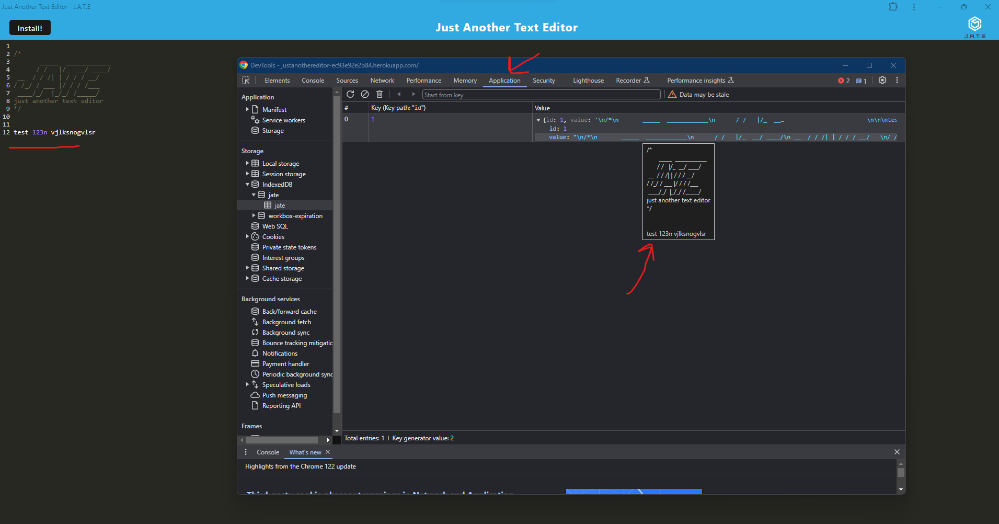

# Just_Another_Text_Editor

Welcome to J.A.T.E (Just Another Text Editor) - a versatile text editor that allows you to conveniently store your notes in an indexed database directly within your browser! This application utilizes a development server for seamless local installation, employing the manifest and service worker to enhance performance and user experience!

Simply go to the URL provided in this README file and give it a try! check out the application tab in your inspect tool and see your notes being stored!

## Acceptance Criteria

```md
GIVEN a text editor web application
WHEN I open my application in my editor
THEN I should see a client server folder structure
WHEN I run `npm run start` from the root directory
THEN I find that my application should start up the backend and serve the client
WHEN I run the text editor application from my terminal
THEN I find that my JavaScript files have been bundled using webpack
WHEN I run my webpack plugins
THEN I find that I have a generated HTML file, service worker, and a manifest file
WHEN I use next-gen JavaScript in my application
THEN I find that the text editor still functions in the browser without errors
WHEN I open the text editor
THEN I find that IndexedDB has immediately created a database storage
WHEN I enter content and subsequently click off of the DOM window
THEN I find that the content in the text editor has been saved with IndexedDB
WHEN I reopen the text editor after closing it
THEN I find that the content in the text editor has been retrieved from our IndexedDB
WHEN I click on the Install button
THEN I download my web application as an icon on my desktop
WHEN I load my web application
THEN I should have a registered service worker using workbox
WHEN I register a service worker
THEN I should have my static assets pre cached upon loading along with subsequent pages and static assets
WHEN I deploy to Heroku
THEN I should have proper build scripts for a webpack application
```

### Technical Acceptance Criteria: 

* Satisfies all of the above acceptance criteria plus the following:

  * Uses IndexedDB to create an object store and includes both GET and PUT methods

  * The application works without an internet connection

  * Automatically saves content inside the text editor when the DOM window is unfocused

  * Bundled with webpack

  * Create a service worker with workbox that Caches static assets

  * The application should use babel in order to use async / await

  * Application must have a generated `manifest.json` using the `WebpackPwaManifest` plug-in

  * Can be installed as a Progressive Web Application


### Screenshot Of Application




## Heroku Deployed URL

  https://justanothereditor-ec93e92e2b84.herokuapp.com/ 

## Github Deployed URL

https://github.com/waltscode/Just_Another_Editor